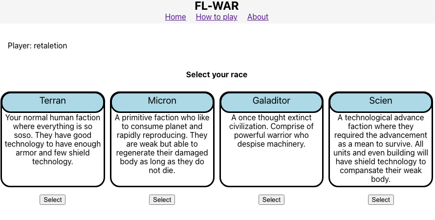

# FL WAR

### By: Fredy Laksmono
### Last update: 10/28/2022

***
## Description
Welcome to FL War. This is a multiplayer game where two players fight for supermacy in teritorial controlling and unit management strategy.   

Players need to choose race and design their team that they will bring to battle arena.

Players will move semi asynchronously to build and command their unit during the battle part.
***
## Build Status
### Phase 1 build (Completed)
* Working home page & about page
* Create user object (no password)
* Create deck
* Manage deck
    * Update deck
    * Delete deck

### Phase 2 build (Future Update)
* Arena creation (include harvester)
* Spawn builder
* Move builder
* Round timer
* Builder build defense unit
* Builder build attack unit
* Move unit
* Move between grid
* Harvester capture
* 2 players setup
* Play Now
    * Create Server
    * Find Server

***

## How to play

You can access the game [here](https://fl-war.herokuapp.com/)

Phase 1:

1. You need to create an account first. Make a copy of the url provided or book mark it as that will be your unique url for your account.  
2. Create your deck. You can only have one deck per account.  
3. Select your race. If you want to change your race after you create the deck, you need to delete your deck and create a new one.  
4. Select your unit. You can only have 3 attack units and 2 defense units. Selecting duplicate is allow if you want to handicap your self.  
    To remove a selected unit, you can click the unit selected on your deck.  
5. Once you finish with your selection, click the create deck button. You can only click it when you have a full roster.  
6. As long as you have an active deck, you can always update your unit roster by click modify deck. Delete your deck if you want to use different race.
        

---

## Technology used

Full-Stack MERN
* MongoDB
* Express(.js)
* React(.js)
* Node(.js)

Published at Heroku

---

## Trelo Board
[My Project Board](https://trello.com/b/bkrS1lJi/fl-war)

---
## Screenshot

---

## Credit

